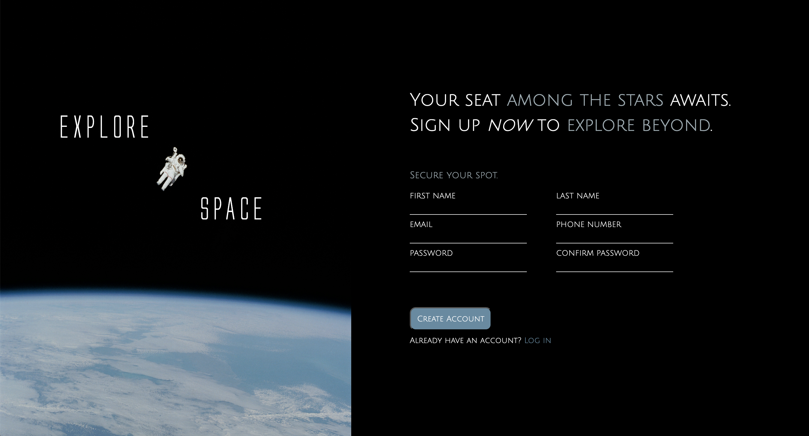

# sign-up-form
Live preview can be found <a href="http://motokaneyuki.github.io/sign-up-form">here</a>.

# Purpose
This is a simple project created to practice building and structuring HTML forms. 

The goal of this project was to learn the fundamentals of form creation, including:

- Using proper form labels and input types.

- Organizing layouts for a clean user experience.

- Applying CSS styles to form elements.

# Technologies Used
- HTML5
- CSS3

# Future plans
- Responsive design

# Attributions
Photo by <a href="https://unsplash.com/@nasa?utm_source=unsplash&utm_medium=referral&utm_content=creditCopyText">NASA</a> on <a href="https://unsplash.com/photos/astronaut-in-spacesuit-floating-in-space-Yj1M5riCKk4?utm_source=unsplash&utm_medium=referral&utm_content=creditCopyText">Unsplash</a>
      
Font by <a href='https://www.fontspace.com/alien-league-font-f32776'>Iconian Fonts</a> on <a href="https://www.fontspace.com/">Fontspace</a>